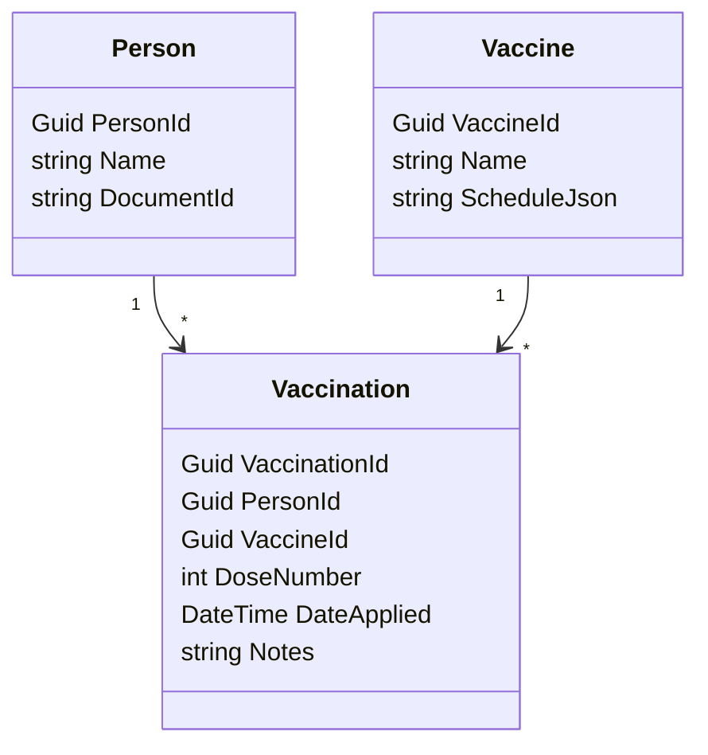

# VaccinationCard API (C#/.NET 8)

Sistema simples para gerenciar **cartão de vacinação**: cadastro de pessoas, vacinas e registros de vacinação, com rotas REST, **CQRS + MediatR**, **FluentValidation**, **EF Core** e **Swagger**.

## Stack & Decisões
- **Arquitetura:** Clean (Domain, Application, Infrastructure, API) + **CQRS (MediatR)**.
- **Validação:** FluentValidation por request.
- **Persistência:** EF Core com **SQLite** (dev). Suporte fácil a PostgreSQL/SQL Server.
- **Docs/Tests manuais:** Swagger/OpenAPI em `/swagger`.

## Estrutura de Pastas
```
src/
  Api/                  # Controllers, DI, Swagger
  Application/          # Commands/Queries + Handlers + Validators (MediatR/FluentValidation)
  Domain/               # Entidades e regras puras
  Infrastructure/       # DbContext, Mappings, Migrations
tests/
  Api.Tests/            # Testes (unit/integration)
```

## Modelo de Domínio
- **Person**(PersonId, Name, DocumentId* único)
- **Vaccine**(VaccineId, Name* único, ScheduleJson?)
- **Vaccination**(VaccinationId, PersonId(FK), VaccineId(FK), DoseNumber≥1, DateApplied, Notes?)
- Regras DB: `UNIQUE(PersonId, VaccineId, DoseNumber)`; **cascade** ao excluir Person.


## Como rodar

```bash
# 1) restaurar e compilar
dotnet restore
dotnet build

# 2) aplicar migrations no SQLite (arquivo vaccination.db)
dotnet tool install --global dotnet-ef
dotnet ef migrations add InitPersons -p src/Infrastructure -s src/Api
dotnet ef database update -p src/Infrastructure -s src/Api

# 3) subir a API
dotnet run --project src/Api
# abra: http://localhost:5xxx/swagger
````

## Próximos passos

* Implementar **Vaccine** e **Vaccination**.
* Adicionar **Auth/JWT** (bônus).
* Dockerfile + CI opcional.

