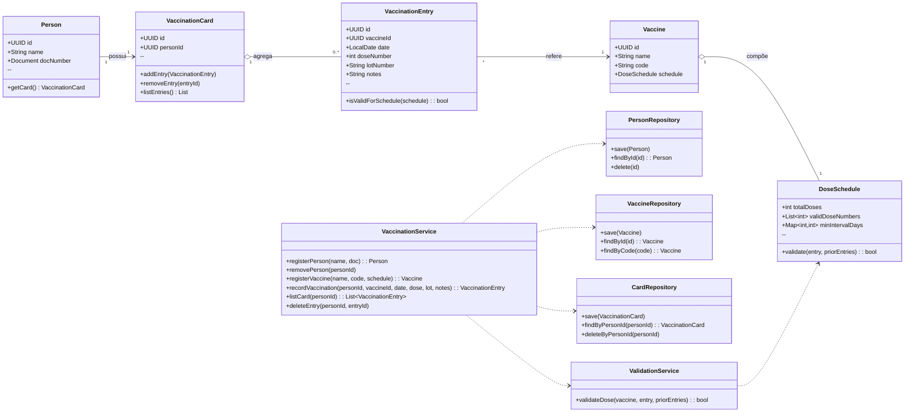

## 📊 Diagrama de Classes (UML)

```mermaid
classDiagram
    direction LR

    class Person {
      +UUID id
      +String name
      +Document docNumber
      --
      +getCard() VaccinationCard
    }

    class VaccinationCard {
      +UUID id
      +UUID personId
      --
      +addEntry(VaccinationEntry)
      +removeEntry(entryId)
      +listEntries() List<VaccinationEntry>
    }

    class Vaccine {
      +UUID id
      +String name
      +String code
      +DoseSchedule schedule
    }

    class VaccinationEntry {
      +UUID id
      +UUID vaccineId
      +LocalDate date
      +int doseNumber
      +String lotNumber
      +String notes
      --
      +isValidForSchedule(schedule) : bool
    }

    class DoseSchedule {
      +int totalDoses
      +List~int~ validDoseNumbers
      +Map~int,int~ minIntervalDays
      --
      +validate(entry, priorEntries) : bool
    }

    class PersonRepository {
      +save(Person)
      +findById(id) : Person
      +delete(id)
    }

    class VaccineRepository {
      +save(Vaccine)
      +findById(id) : Vaccine
      +findByCode(code) : Vaccine
    }

    class CardRepository {
      +save(VaccinationCard)
      +findByPersonId(personId) : VaccinationCard
      +deleteByPersonId(personId)
    }

    class VaccinationService {
      +registerPerson(name, doc) : Person
      +removePerson(personId)
      +registerVaccine(name, code, schedule) : Vaccine
      +recordVaccination(personId, vaccineId, date, dose, lot, notes) : VaccinationEntry
      +listCard(personId) : List~VaccinationEntry~
      +deleteEntry(personId, entryId)
    }

    class ValidationService {
      +validateDose(vaccine, entry, priorEntries) : bool
    }

    %% Relações
    Person "1" --> "1" VaccinationCard : possui
    VaccinationCard "1" o-- "0..*" VaccinationEntry : agrega
    VaccinationEntry "*" --> "1" Vaccine : refere
    Vaccine "1" o-- "1" DoseSchedule : compõe

    %% Serviços usam repositórios
    VaccinationService ..> PersonRepository
    VaccinationService ..> VaccineRepository
    VaccinationService ..> CardRepository
    VaccinationService ..> ValidationService
    ValidationService ..> DoseSchedule
```
